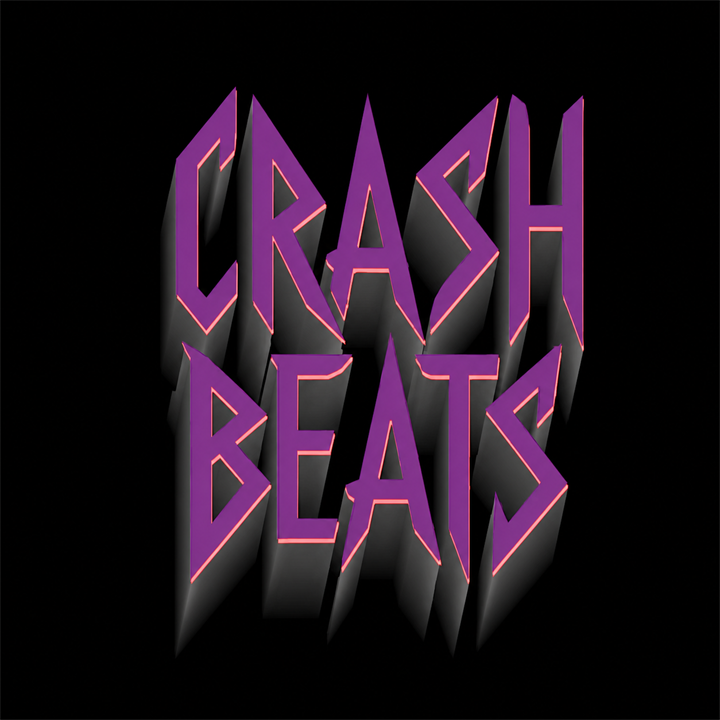

<p align="center">
  
</p>

# Crash Beats

A music showcase built around an interactive retro boombox. Browse cassette-style mixtapes, play tracks, discover featured artists through Crash Weekly, and submit music for a future feature.

**[Visit Crash Beats](https://crash-beats.com)**

## Features

- **Interactive tape deck** with cassette selection, playback controls, volume adjustment, and animated speakers.
- **Mixtape archive** with nine themed collections and visual effects that change with the selected tape.
- **Crash Weekly** with a featured artist, social links, and an artist schedule.
- **Listener accounts** with email/password authentication, optional Google sign-in, and email confirmation through Resend.
- **Weekly download credits** that reward returning listeners and persist across account deletion and recreation.
- **Artist submissions** with up to three MP3 uploads, validated artist links, and Cloudflare Turnstile verification.
- **Responsive layouts** for desktop and mobile, with keyboard-accessible dialogs and playback controls.

## Built with

| Layer | Technology |
| --- | --- |
| Interface | React, Vite, CSS, Lucide icons |
| API and hosting | Cloudflare Workers and static assets |
| Database | Cloudflare D1 / SQLite |
| Audio storage | Cloudflare R2 |
| Authentication | Better Auth |
| Email confirmation | Resend |
| Submission protection | Cloudflare Turnstile |
| Artist scheduling | Google Sheets and Apps Script |
| Testing | Vitest and Playwright browser checks |

The React app and API share one origin. The Worker reads catalog and account data from D1 and streams published audio from a private R2 bucket with HTTP byte-range support. Pending submissions stay private until selected for publication. Audio files are stored separately from the frontend build.

## Run locally

Use **Node.js 24** and npm. The browser checks also require Chrome or Edge; set `CHROME_PATH` if the browser is installed in a nonstandard location.

### Preview the interface

```bash
npm ci
npm run dev
```

Open the local URL printed by Vite. The bundled catalog lets you explore the interface without connecting external services. Playback, accounts, and submissions need the Worker and their corresponding data or credentials.

### Run the Worker and API

Copy [.dev.vars.example](.dev.vars.example) to `.dev.vars`. Set `BETTER_AUTH_SECRET` to a random value of at least 32 characters and keep the local origin set to `http://127.0.0.1:8787`.

```bash
npm run db:migrate:local
npm run build
npm run dev:worker
```

Open **http://127.0.0.1:8787**. Wrangler serves the built interface and API together using local D1 and R2 storage. Rebuild the frontend after UI changes when using this workflow.

Audio source files are not included in this repository. To populate your local catalog, provide your own files and update the source mappings in [src/data/mixtapes.js](src/data/mixtapes.js), then run:

```bash
npm run audio:import -- --local
```

The importer supports the configured directory/archive sources, converts WAV files to MP3, and writes audio metadata and objects to the selected database and bucket.

## Configuration

Keep local credentials in `.dev.vars`, which is ignored by Git. For a deployed Worker, use `npx wrangler secret put NAME` for each secret.

| Setting | Purpose |
| --- | --- |
| `BETTER_AUTH_SECRET` | Required signing secret; use a different random value in each environment. |
| `BETTER_AUTH_URL` | Public origin of the app, without `/api/auth`. |
| `BETTER_AUTH_TRUSTED_ORIGINS` | Optional comma-separated additional origins trusted by authentication. |
| `GOOGLE_CLIENT_ID`, `GOOGLE_CLIENT_SECRET` | Enable Google sign-in when both are configured. |
| `RESEND_API_KEY`, `AUTH_EMAIL_FROM` | Enable email confirmation when both are configured. |
| `TURNSTILE_SECRET_KEY` | Required for accepting artist submissions. |
| `SUBMISSION_HASH_SALT` | Private salt for submission IP fingerprints. |
| `GOOGLE_SHEETS_WEBHOOK_URL`, `GOOGLE_SHEETS_WEBHOOK_SECRET` | Connect the private artist schedule and submission workflow. |

For Google sign-in, register your app origin and the callback URL `https://your-domain.example/api/auth/callback/google` in your OAuth client.

For email confirmation, verify your sending domain in Resend and set `AUTH_EMAIL_FROM` to a sender on that domain, such as `Crash Beats <accounts@your-domain.example>`. A code is sent automatically when an unverified listener opens the confirmation screen. Codes expire after ten minutes, are stored as hashes, and have attempt and resend limits. Reopening the screen during the same page session reuses an unexpired code. Password-reset email is not currently implemented.

For artist submissions, configure your own Turnstile widget and replace the public site key in [WeeklySubmissionForm.jsx](src/components/WeeklySubmissionForm.jsx). The [Apps Script setup guide](google-apps-script/README.md) covers the spreadsheet integration; adapt its spreadsheet, owner, and recipient settings to your own project.

## How download credits work

Opening Crash Weekly while signed in awards **two credits once per week**. Each week begins Monday at 00:00 UTC. Downloading a published catalog track costs one credit; Crash Weekly tracks do not have a download button.

The balance and weekly claim history survive account deletion. Recreating an account with the same email cannot reset the reward schedule. Access to a previous account's balance requires verified email ownership, through email confirmation or a verified Google identity. Confirmation restores access without awarding another weekly reward.

Published tracks can be streamed without an account. The download-credit system controls the download feature; public audio streams can still be saved by listeners.

## Project structure

```text
src/
  components/          Boombox, cassette deck, account dialogs, and submission form
  hooks/               Playback, catalog, account, and weekly artist state
  data/                Mixtape definitions and artist fallbacks
shared/                Artist-link validation shared by browser and Worker
worker/                API, authentication, email delivery, and security helpers
migrations/            D1 database migrations
scripts/               Audio import and browser QA tools
public/                Branding, static files, and security headers
google-apps-script/    Private schedule and submission integration
```

## Checks

```bash
npm test
npm run build
npm run qa:visual
npm run qa:email
npx wrangler deploy --dry-run
```

Vitest covers the API, authentication, credits, validation, and code-confirmation lifecycle. Browser checks exercise desktop and phone layouts, playback, dialogs, submissions, and email confirmation. Browser scenarios use fixture APIs, and email tests mock Resend without sending real messages.

## Deploy your own instance

This repository includes configuration for the original Crash Beats deployment. Before deploying a fork, create your own Cloudflare D1 database and private R2 bucket, then update the resource identifiers, Worker name, origins, and integration settings in [wrangler.jsonc](wrangler.jsonc). If you choose different database or bucket names, also update the migration commands in [package.json](package.json) and the targets in [scripts/import-audio.mjs](scripts/import-audio.mjs).

Configure the required Worker secrets, update the site URLs and branding for your instance, then apply migrations and deploy:

```bash
npm run db:migrate:remote
npm run deploy
```

After preparing your audio sources, import them with `npm run audio:import -- --remote`. Local and remote imports require an explicit target.

Verify your authentication providers, email delivery, Turnstile, and spreadsheet integration after deployment.
